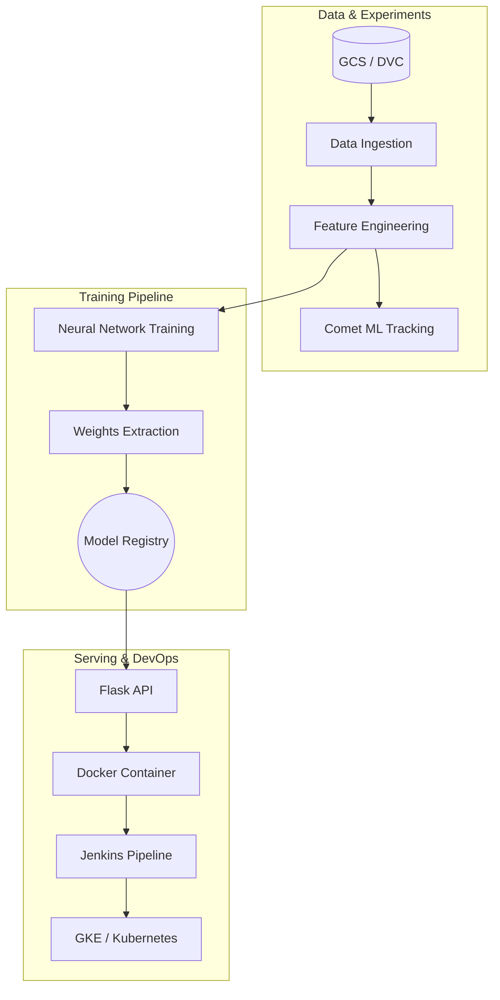

<div align="center">
  

  # 🎬 Anime Recommendation System — End-to-End MLOps Pipeline
  <p><i>A production-grade Neural Network recommender system delivering personalized anime titles, powered by a robust GCP-based MLOps architecture.</i></p>

  <p>
    
    
    
    
    
    
  </p>
</div>

---

## 🎯 Executive Summary

In the vast world of anime, users often face "choice paralysis." This project provides a sophisticated solution: a **Hybrid Recommendation Engine** that combines the power of Deep Learning (Neural Collaborative Filtering) with Content-Based filtering.

Beyond the algorithm, this repository is a showcase of **Enterprise MLOps Practices**. It demonstrates a complete lifecycle—from version-controlled data and experiment tracking to automated CI/CD pipelines and containerized orchestration on Kubernetes.

## 🚀 Key Engineering Highlights

*   **🧠 Neural Recommender Engine**: Built using a Keras-based `RecommenderNet` with trainable embeddings for users and anime titles, optimized for high-dimensional preference mapping.
*   **🔄 Hybrid Logic**: A sophisticated ensemble approach combining User-User Collaborative Filtering (via embedding similarity) and Content-Based filtering (via metadata analysis).
*   **📉 Experiment Tracking (Comet ML)**: Integrated with **Comet ML** to log training metrics (loss, val_loss), hyperparameter tuning, and model assets in real-time.
*   **🏗️ Data Version Control (DVC)**: Implemented DVC for handling large datasets and model artifacts, using **Google Cloud Storage (GCS)** as a remote backend to ensure reproducibility.
*   **🛠️ Industrial CI/CD (Jenkins)**: A multi-stage Jenkins pipeline that automates:
    *   Secure environment setup.
    *   Data pulling via DVC.
    *   Docker image construction.
    *   Automated deployment to **Google Kubernetes Engine (GKE)**.
*   **🐳 Production Orchestration**: Full containerization via Docker and Kubernetes manifests (`deployment.yaml`) for horizontal scaling and high availability.

---

## 🏗️ System Architecture

The project follows a modular, decoupled architecture designed for scale:



## 🛠️ Technology Stack

| Domain | Tools |
| :--- | :--- |
| **ML & Deep Learning** | `TensorFlow`, `Keras`, `Scikit-Learn`, `Pandas`, `NumPy` |
| **Experiment Tracking** | `Comet ML` |
| **Data Orchestration** | `DVC` (GCS Remote Storage) |
| **Backend / UI** | `Flask`, `Jinja2`, `HTML5/CSS3` |
| **DevOps / CI/CD** | `Docker`, `Jenkins`, `Google Cloud (GCR)`, `Kubernetes (GKE)` |

---

## 📂 Repository Structure

```text
├── artifacts/          # Serialized models, embeddings, and encoders (DVC-tracked)
├── config/             # Configuration YAMLs for paths and hyperparameters
├── pipeline/           # Orchestration logic (Training & Prediction)
├── src/                # Core implementation package
│   ├── data_ingestion.py    # Robust data loading from sources
│   ├── data_preprocessing.py # Feature engineering & encoding
│   ├── model_training.py     # Neural Network training logic & Comet ML integration
│   ├── base_model.py         # Keras Model architecture (RecommenderNet)
│   ├── logger.py             # Standardized logging
│   └── custom_exception.py   # Unified error handling
├── static/ & templates/ # Web UI components
├── application.py      # Entry point for the Flask application
├── Dockerfile          # Multi-stage Docker build
├── Jenkinsfile         # CI/CD Pipeline definition
└── deployment.yaml     # Kubernetes orchestration manifests
```

---

## ⚙️ Quick Start & Local Execution

### 1. Clone & Setup
```bash
git clone https://github.com/mohamed-elaouan/Anime_Recomendation_MLOps.git
cd Anime_Recomendation_Project
python -m venv venv
source venv/bin/activate  # venv\Scripts\activate on Windows
pip install -r requirements.txt
pip install -e .
```

### 2. Configure Credentials
Ensure your GCP credentials and Comet ML API keys are configured in your environment or `src/model_training.py`.

### 3. Run the Application
```bash
python application.py
```
Visit `http://localhost:5000` to interact with the dashboard.

---

## 🚢 MLOps & Deployment Pipeline

*   **DVC Integration**: Large artifacts are stored in GCS. Run `dvc pull` to fetch the latest model weights.
*   **Dockerization**: Build the production image: `docker build -t anime-recsys .`
*   **Jenkins CI/CD**: The pipeline triggers on every push, ensuring that the latest code is built, containerized, and deployed to the Kubernetes cluster automatically.
*   **Kubernetes (GKE)**: Scalable deployment using the provided `deployment.yaml`, ensuring the recommendation service stays online under load.

---

## 👨‍💻 Author
**Mohamed El Aouan**  
*Data Scientist & MLOps Engineer*  
*Specializing in building end-to-end ML systems that bridge the gap between research and production.*

---
*If you found this project helpful, please consider giving it a ⭐!*

